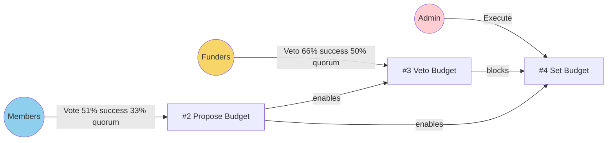
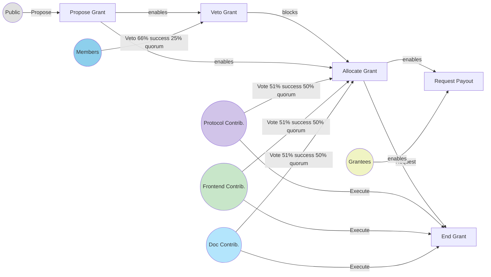
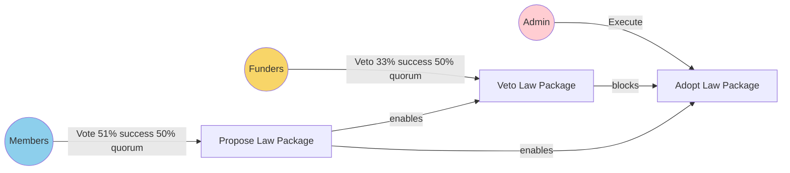
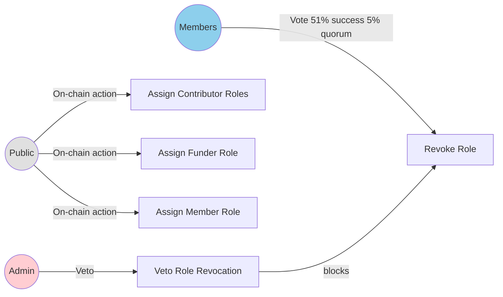

I am building a blockchain protocol for institutional governance called Powers. 
- The documentation for the protocol can be found at powers-docs.vercel.app. 
- the github repo is github.com/7cedars/powers

The task is to create specs for an organisation build using the Powers protocol. You will receive an empty spec sheet that only include the general description of what the organisation should do and what existing contracts it should interact with. Your task is to fill out the task sheet further. 

As examples you can use 

develop the specs and governance system of this organisation. The 

The following sources are available to you:   

In the  `Governance Flow Diagram` section, please create a mermaid digram following the examples below as strictly as possible. Please also use subheadings

### Grant Process

### Constitutional Process

### Electoral Process

Thank you.   