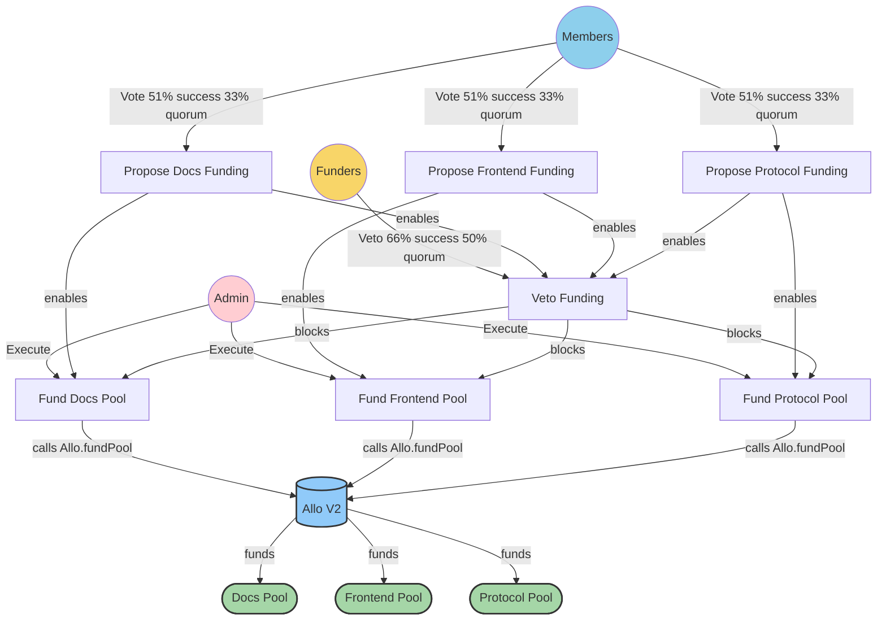
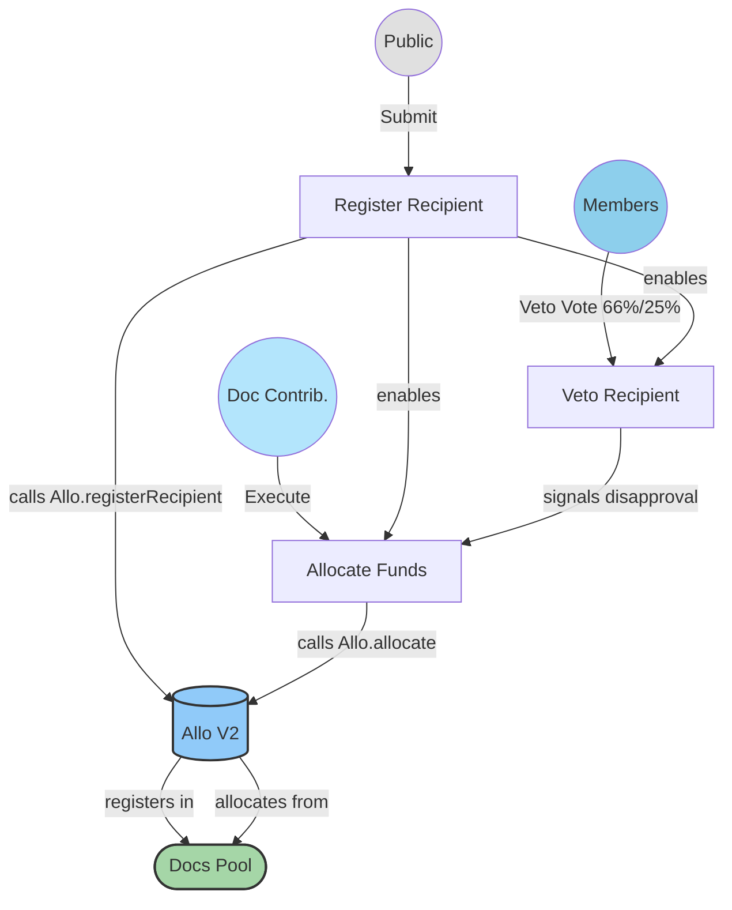
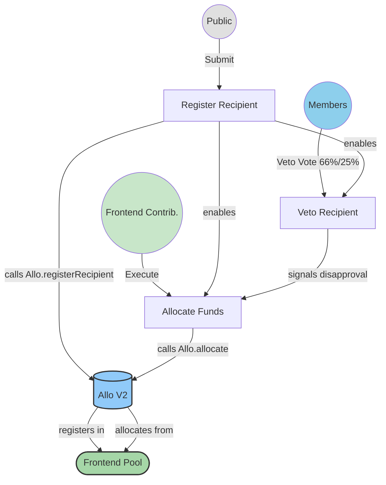
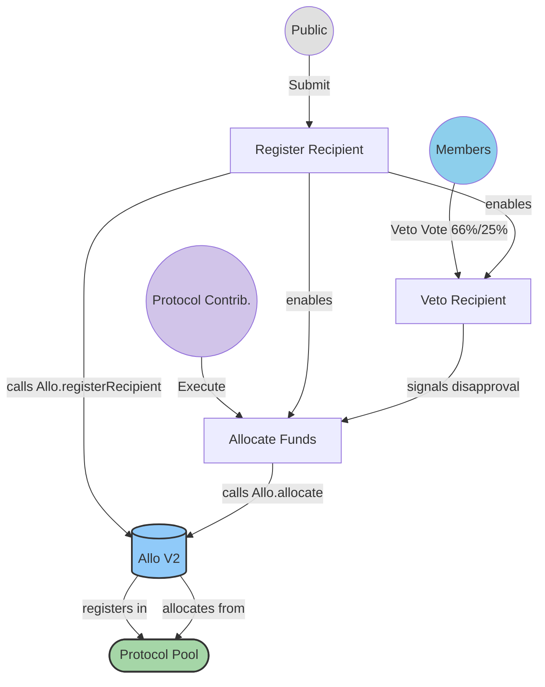
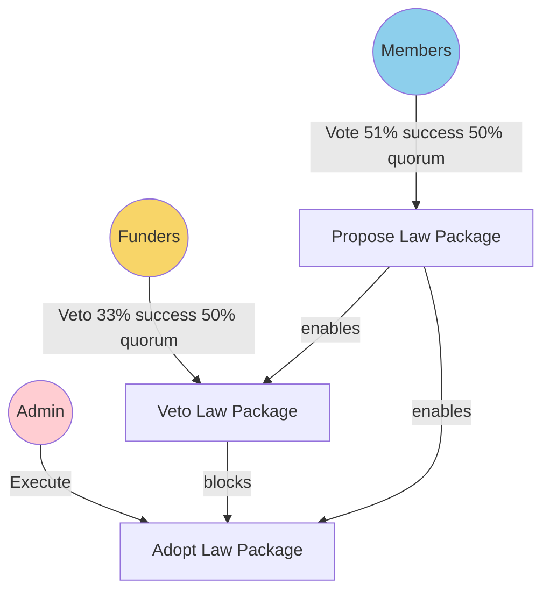
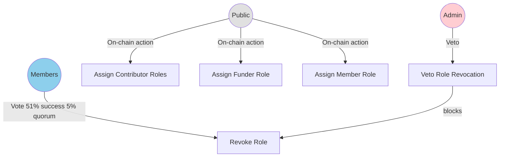

import { Callout } from 'vocs/components'

<Callout type="warning">
  Powers Base is under development. The organisational specs are subject to change.
</Callout>

# **Power Base Organisational Specs**

## **Organisational Structure & Context**

### ***Vision & Mission***

Power Base is the non-profit on-chain organisation that shepherds the development of the Powers protocol.

### ***Treasury Management***

Its principle task is to distribute funding into three development areas: **protocol**, **frontend**, and **documentation**. It does this using Allo v2 pools governed by the Powers protocol. Decisions on how to distribute available funds *between* these three areas are taken collectively by members.

The organization manages three separate Allo v2 pools, each utilizing the DirectGrantsLiteStrategy:

* **Documentation Pool** - Manages documentation-related grants. Pool managers are Documentation Contributors (Role 2).
* **Frontend Pool** - Manages frontend development grants. Pool managers are Frontend Contributors (Role 3).
* **Protocol Pool** - Manages protocol development grants. Pool managers are Protocol Contributors (Role 4).

Each pool is funded independently based on Member proposals and Admin execution. Grant recipients register with the relevant pool, and allocations are made by the designated Pool Managers (the contributor groups).

### ***Funding Policy***

The funding policy outlines the distribution of funds into three Allo v2 pools: protocol, frontend, and documentation. Decisions regarding the allocation of available funds *between* these pools are made collectively by Members. Each pool operates independently, ensuring fair distribution and preventing one area from depleting funds intended for others.

## **Roles**

| **Role Id** | **Role name** | **Selection criteria** |
| :---- | :---- | :---- |
| 0 | Admin | Admin role assigned at deployment. |
| 1 | Funders | An account that has transferred funds in either native currency or whitelisted token during the last 90 days. |
| 2 | Documentation Contributors | An account that has made a contribution to the gitbook folder in the Powers repo during the last 90 days. Acts as Pool Manager/Allocator for the Documentation Pool. |
| 3 | Frontend Contributors | An account that has made a contribution to the frontend folder in the Powers repo during the last 90 days. Acts as Pool Manager/Allocator for the Frontend Pool. |
| 4 | Protocol Contributors | An account that has made a contribution to the solidity folder in the Powers repo during the last 90 days. Acts as Pool Manager/Allocator for the Protocol Pool. |
| 5 | Members | An account that holds role 1, 2, 3 or 4. |
| 6 | Grantees | Accounts registered as recipients in one of the Allo pools. |
| … | Public | Everyone. |

 

## **On-chain Laws**

### ***Executive Laws (executing actions)***

#### **Pool Management & Funding**

*(Note: Pool creation happens once at setup or via a constitutional process. Funding is ongoing.)*

| **Role** | **Name & Description** | **Base contract** | **User Input** | **Executable Output** | **Conditions** |
| :---- | :---- | :---- | :---- | :---- | :---- |
| Members | Propose Documentation Funding | StatementOfIntent.sol | "address TokenAddress", "uint256 Amount" | none | 51% success, 33% quorum, 7 day period |
| Members | Propose Frontend Funding | StatementOfIntent.sol | "address TokenAddress", "uint256 Amount" | none | 51% success, 33% quorum, 7 day period |
| Members | Propose Protocol Funding | StatementOfIntent.sol | "address TokenAddress", "uint256 Amount" | none | 51% success, 33% quorum, 7 day period |
| Funders | Veto Funding Proposal | StatementOfIntent.sol | "address TokenAddress", "uint256 Amount" | none | 66% success, 50% quorum, 3 day period, funding proposal must exist |
| Admin | Fund Documentation Pool | BespokeActionSimple.sol | "address TokenAddress", "uint256 Amount" | Allo.fundPool(docsPoolId, amount) | Documentation Funding proposal fulfilled, veto not fulfilled |
| Admin | Fund Frontend Pool | BespokeActionSimple.sol | "address TokenAddress", "uint256 Amount" | Allo.fundPool(frontendPoolId, amount) | Frontend Funding proposal fulfilled, veto not fulfilled |
| Admin | Fund Protocol Pool | BespokeActionSimple.sol | "address TokenAddress", "uint256 Amount" | Allo.fundPool(protocolPoolId, amount) | Protocol Funding proposal fulfilled, veto not fulfilled |

 

#### **Documentation Grants (via Allo Pool)**

| **Role** | **Name & Description** | **Base contract** | **User Input** | **Executable Output** | **Conditions** |
| :---- | :---- | :---- | :---- | :---- | :---- |
| Public | Register as Recipient (Docs) | BespokeActionSimple.sol | bytes data (includes recipient address, metadata) | Allo.registerRecipient(docsPoolId, data) | Public access |
| Members | Veto Recipient Registration (Docs) | StatementOfIntent.sol | "address recipientId" | none | 66% success, 25% quorum, 3 day period. (Note: Enforcement requires off-chain coordination or a subsequent law to remove allocator approval if veto passes after registration) |
| Doc Contributors | Allocate Funds (Docs) | BespokeActionSimple.sol | "address recipientId", "uint256 amount", "address token" | Allo.allocate(docsPoolId, recipientId, amount, token, address(this)) | Recipient must be registered, Veto not fulfilled (checked off-chain or via conditions if applicable) |

 

#### **Frontend Grants (via Allo Pool)**

| **Role** | **Name & Description** | **Base contract** | **User Input** | **Executable Output** | **Conditions** |
| :---- | :---- | :---- | :-- | :-- | :--------------------- |
| Public | Register as Recipient (Frontend) | BespokeActionSimple.sol | bytes data (includes recipient address, metadata) | Allo.registerRecipient(frontendPoolId, data) | Public access |
| Members | Veto Recipient Registration (Frontend) | StatementOfIntent.sol | "address recipientId" | none | 66% success, 25% quorum, 3 day period. (Note: Enforcement requires off-chain coordination or a subsequent law) |
| Frontend Contributors | Allocate Funds (Frontend) | BespokeActionSimple.sol | "address recipientId", "uint256 amount", "address token" | Allo.allocate(frontendPoolId, recipientId, amount, token, address(this)) | Recipient must be registered, Veto not fulfilled |

 

#### **Protocol Grants (via Allo Pool)**

| **Role** | **Name & Description** | **Base contract** | **User Input** | **Executable Output** | **Conditions** |
| :---- | :---- | :---- | :---- | :---- | :---- |
| Public | Register as Recipient (Protocol) | BespokeActionSimple.sol | bytes data (includes recipient address, metadata) | Allo.registerRecipient(protocolPoolId, data) | Public access |
| Members | Veto Recipient Registration (Protocol) | StatementOfIntent.sol | "address recipientId" | none | 66% success, 25% quorum, 3 day period. (Note: Enforcement requires off-chain coordination or a subsequent law) |
| Protocol Contributors | Allocate Funds (Protocol) | BespokeActionSimple.sol | "address recipientId", "uint256 amount", "address token" | Allo.allocate(protocolPoolId, recipientId, amount, token, address(this)) | Recipient must be registered, Veto not fulfilled |

 

### ***Electoral Laws (assigning roles)***

| **Role** | **Name & Description** | **Base contract** | **User Input** | **Executable Output** | **Conditions** |
| :---- | :---- | :---- | :---- | :---- | :---- |
| Public | Github to EVM | StringToAddress.sol | "string githubUsername" | Maps GitHub to EVM address | Public access |
| Public | Github to Role | RoleByGitCommit.sol |  | Assigns roles 2, 3, 4 | Github to EVM mapping must exist |
| Public | Fund Development | BuyAccess.sol | "uint256 amount" | Assigns role 1 (Funder) | Public access, requires token transfer |
| Public | Apply for Membership | RoleByRoles.sol |  | Assigns role 5 (Member) | Must have role 1, 2, 3, or 4 |
| Members | Remove Role | DirectDeselect.sol | "address[] accounts", "uint256 roleId" | Revokes role from accounts | 51% success, 5% quorum, 5 day period, 5 day delay, not vetoed |
| Admin | Veto Role Revocation | StatementOfIntent.sol | "address[] accounts" | none | Admin only |

 

### ***Constitutional Laws (adopting and revoking laws)***

| **Role** | **Name & Description** | **Base contract** | **User Input** | **Executable Output** | **Conditions** |
| :---- | :---- | :---- | :---- | :---- | :---- |
| Members | Propose Law Package | StatementOfIntent.sol | "address[] laws", "bytes[] lawInitDatas" | none | 51% success, 50% quorum, 7 day period |
| Funders | Veto Law Package | StatementOfIntent.sol | "address[] laws", "bytes[] lawInitDatas" | none | 33% success, 50% quorum, 3 day period, proposal must exist |
| Admin | Adopt Law Package | AdoptLaws.sol | (from proposal) | Adopts new laws | Proposal fulfilled, veto not fulfilled |

 

## **Off-chain Operations**

*(Largely unchanged, references updated)*

### ***Dispute Resolution***

Disputes regarding ambiguous law conditions, Allo pool operations, or malicious actions by role-holders will be addressed through community discussion in the official communication channels, with final arbitration by the Admin role if consensus cannot be reached.

### ***Code of Conduct / Ethics***

All participants are expected to act in good faith to further the mission of Power Base. This includes respectful communication, constructive feedback, and responsible use of powers. Grant applications (recipient registrations) should clearly articulate their value and include realistic goals. Allocators (Contributor groups) should review registrations diligently.

### ***Communication Channels***

Official proposals, discussions, and announcements take place on the Power Base Discord server and community forum. Recipient registrations should be discussed in these channels before submission.

### ***Budget Proposal Coordination***

While funding proposals are submitted as three separate on-chain laws (one per development area), the community is encouraged to discuss and coordinate funding allocation across all three areas in off-chain channels before submitting proposals. This ensures balanced funding distribution that reflects the collective priorities of the organization.

## **Description of Governance**

Power Base is a decentralized organization focused on the development of the Powers protocol, now utilizing Allo v2 for grant distribution.

* **Remit**: The primary function is to manage and distribute funds for protocol, frontend, and documentation development via three dedicated Allo v2 pools using the DirectGrantsLiteStrategy.
* **Roles**: Roles are assigned based on contributions (code commits for Contributors, funding for Funders). Contributor groups (Docs, Frontend, Protocol) act as allocators for their respective Allo pools. Having any contributor or funder role makes one a Member. An Admin role manages core functions.
* **Executive Paths**: Key processes are governed by on-chain laws interacting with the Allo v2 contract:
  * **Pool Funding**: Members propose funding amounts for each pool separately, Funders can veto any proposal, and Admins execute the funding via Allo.fundPool.
  * **Grant Lifecycle**: Anyone can register as a recipient in a relevant pool (Allo.registerRecipient), Members can signal intent to veto, and the relevant Contributor group (acting as allocators) approves and sends funds by calling Allo.allocate.
* **Summary**: The governance structure leverages Allo v2 pools (DirectGrantsLiteStrategy) as secure, independently funded mechanisms for grant distribution. The Powers protocol provides the governance layer determining who proposes funding, who executes funding, who can register, and who allocates funds within each pool, creating a complete decentralized grant management system.

## **Governance Flow Diagrams**

### **Pool Funding Process**

### **Documentation Grant Process (Allo V2)**

### **Frontend Grant Process (Allo V2)**

### **Protocol Grant Process (Allo V2)**

### **Constitutional Process**

*(Unchanged from original spec)*

### **Electoral Process**

## Risk Assessment 

### Allo v2 complexity  
Allo V2 is a (very) complex protocol...  

### Additional risks 
Additional risk descriptions here. 

## Deployments

| **Chain name** | **Chain Id** | **Address** |
| :---- | :---- | :---- |
| Optimism Sepolia | 11155420 | 0x00...  |

 
