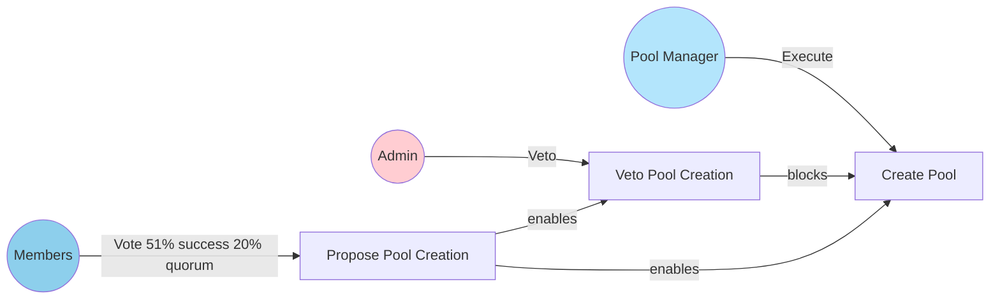
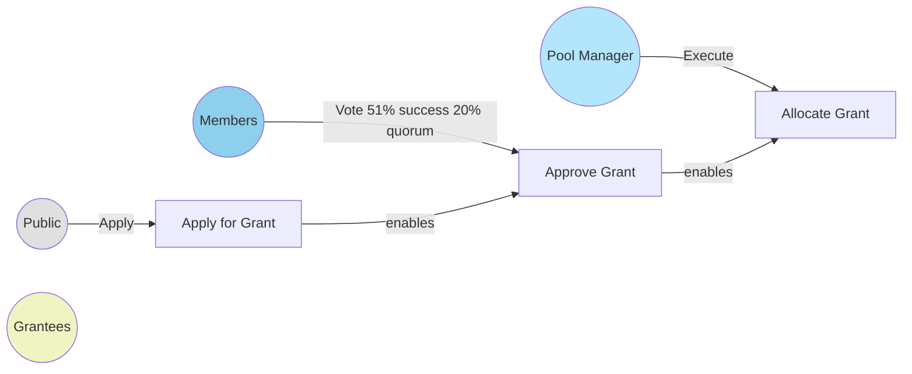
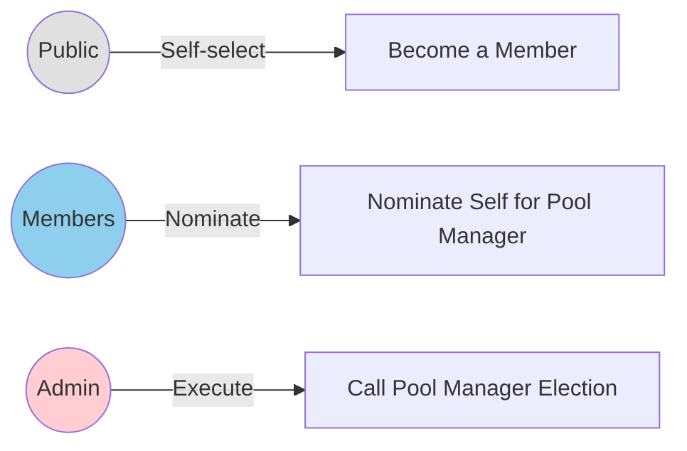
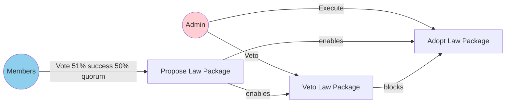

# **Allo Grant Organisation Specification**

## **Organisational Structure & Context**

### ***Vision & Mission***

This organisation is a decentralized grant-giving body that uses the Powers protocol to govern an Allo v2 instance. Its mission is to provide a transparent and community-driven platform for funding public goods and open-source projects. The organisation will use the DirectGrantsLite strategy from Allo v2 for its initial implementation.

### ***Treasury Management***

The organisation's treasury is managed through a combination of the Powers protocol and the Allo v2 DirectGrantsLite strategy. Members can propose the creation of new grant pools, which are then managed by a dedicated Pool Manager. Funds are held in the Allo v2 contract and are distributed to grantees based on community votes.

## **Roles**

| *Role Id* | *Role name* | *Selection criteria.* |
| :---- | :---- | :---- |
| 0 | Admin | Admin role assigned at deployment. |
| 1 | Members | Anyone can self-select to become a member. |
| 2 | Pool Manager | Elected by members to manage Allo v2 pools. |
| 3 | Grantees | Individuals or teams that have received a grant. |
| … | Public | Everyone. |

## **On-chain Laws**

### ***Executive Laws (executing actions)***

| *Role* | *Name & Description* | *Base contract* | *User Input* | *Executable Output* | *Conditions* |
| :---- | :---- | :---- | :---- | :---- | :---- |
| Members | Propose Pool Creation | StatementOfIntent.sol | address strategy, bytes initData | none | 51% success, 20% quorum, 7 day voting period |
| Admin | Veto Pool Creation | StatementOfIntent.sol | address strategy, bytes initData | none | Proposal must exist |
| Pool Manager | Create Pool | BespokeActionSimple.sol | (from proposal) | Allo.createPool() | Proposal must be fulfilled and not vetoed |
| Public | Apply for Grant | BespokeActionSimple.sol | bytes data | Allo.registerRecipient() | Public access |
| Members | Approve Grant | StatementOfIntent.sol | uint256 recipientId | none | 51% success, 20% quorum, 7 day voting period |
| Pool Manager | Allocate Grant | BespokeActionSimple.sol | uint256 recipientId, uint256 amount | Allo.allocate() | Grant must be approved by members |

### ***Electoral Laws (assigning roles)***

| *Role* | *Name & Description* | *Base contract* | *User Input* | *Executable Output* | *Conditions* |
| :---- | :---- | :---- | :---- | :---- | :---- |
| Members | Nominate Self for Pool Manager | NominateMe.sol | none | Adds the caller to the list of nominees for the Pool Manager role. | Caller must be a member. |
| Admin | Call Pool Manager Election | ElectionStart.sol | none | Starts a new election for the Pool Manager role. | Admin only. |
| Public | Become a Member | SelfSelect.sol | uint256 roleId | Assigns the caller the member role. | Public access, 25 block throttle. |

### ***Constitutional Laws (adopting and revoking laws)***

| *Role* | *Name & Description* | *Base contract* | *User Input* | *Executable Output* | *Conditions* |
| :---- | :---- | :---- | :---- | :---- | :---- |
| Members | Propose Law Package | StatementOfIntent.sol | "address[] laws", "bytes[] lawInitDatas" | none | 51% success, 50% quorum, 7 day period |
| Admin | Veto Law Package | StatementOfIntent.sol | "address[] laws", "bytes[] lawInitDatas" | none | Proposal must exist |
| Admin | Adopt Law Package | AdoptLaws.sol | (from proposal) | Adopts new laws | Proposal fulfilled, veto not fulfilled |

## **Off-chain Operations**

### ***Dispute Resolution***

Disputes will be handled through community discussion on the organisation's forum, with the Admin role having the final say in case of a deadlock.

### ***Code of Conduct / Ethics***

All participants are expected to act in good faith and in the best interest of the organisation. Any malicious or unethical behaviour will be grounds for removal from the community.

### ***Communication Channels***

All official communications will happen on the organisation's Discord server and community forum.

## **Description of Governance**

This organisation is a decentralized autonomous organisation (DAO) that leverages the Powers protocol for its governance layer and Allo v2 for its grant-making operations.

* **Remit**: The primary function of the organisation is to fund public goods and open-source projects through a transparent and community-driven process.  
* **Roles**: The organisation has a simple role structure with an **Admin** for managing the system, **Members** for proposing and voting on actions, a **Pool Manager** for managing grant pools, and **Grantees** who receive funding.  
* **Executive Paths**:  
  * **Pool Creation**: Members propose the creation of new grant pools, the Admin can veto them, and the Pool Manager executes the creation of the pool on Allo v2.  
  * **Grant Lifecycle**: Anyone can apply for a grant. Members vote on grant applications, and the Pool Manager allocates the funds to the approved grantees.  
* **Summary**: The governance model is designed to be simple and transparent, with a clear separation of powers between the different roles. This allows for a decentralized and community-driven approach to grant-making, while still maintaining a level of oversight and control through the Admin role.

## **Governance Flow Diagrams**

### **Pool Creation Process**

### **Grant Process**

### **Electoral Process**

### **Constitutional Process**

