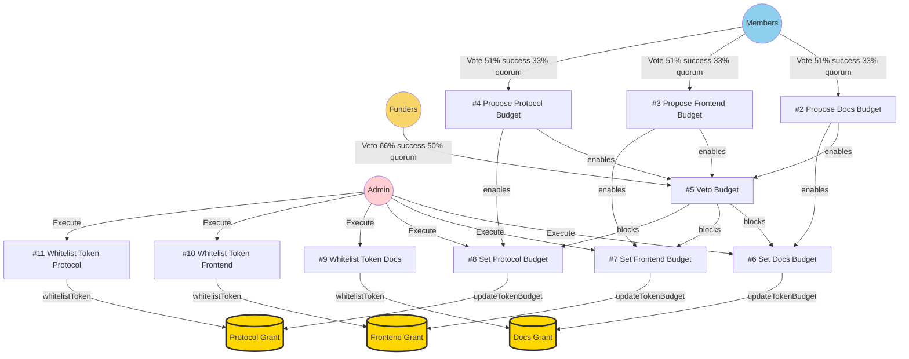
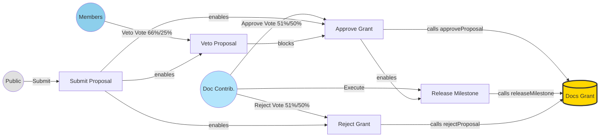
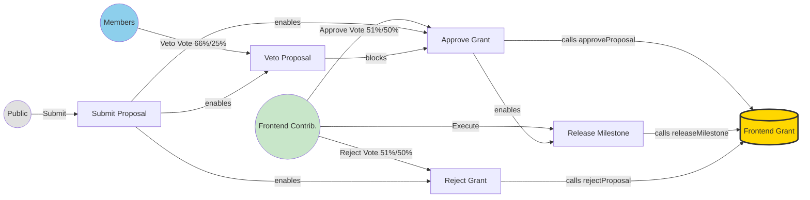
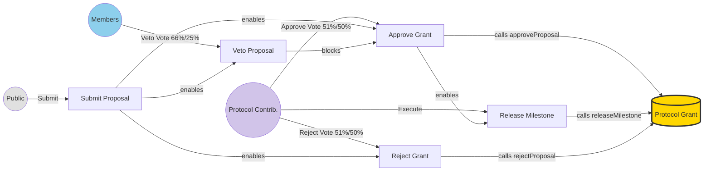
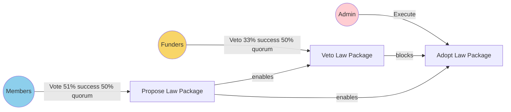
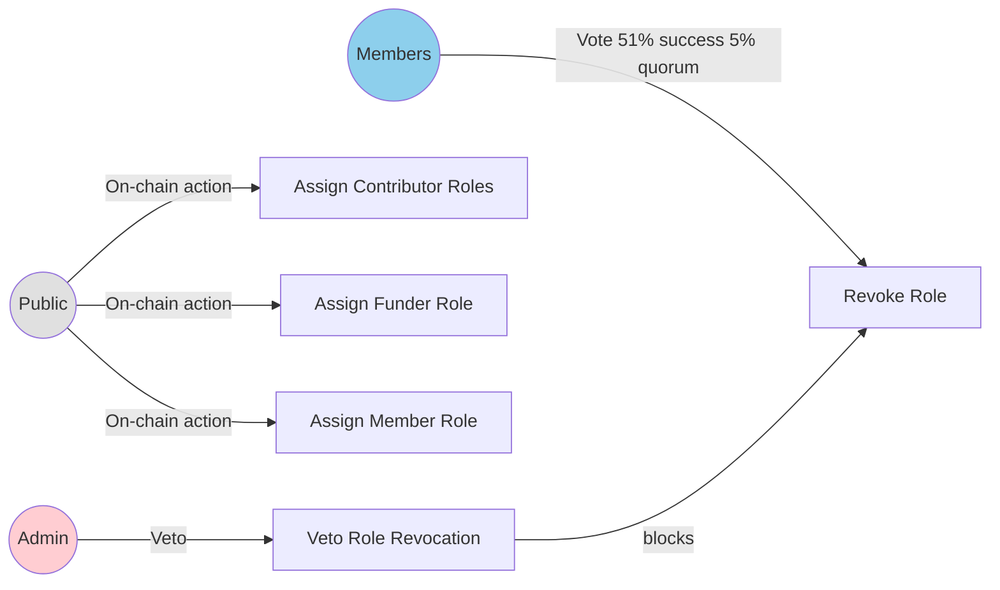

# Power Base Organisation Specification

## Organisational Structure & Context

### *Vision & Mission*

Power Base is the non-profit on-chain organisation that shepherds the development of the Powers protocol.

### *Treasury Management*

Its principle task is to distribute funding into three development areas: protocol, frontend, and documentation. It does this through allocating grants in these areas by the people that are active in these areas themselves. Decisions on how to distribute available funds *between* these three areas are taken collectively by members.

The organization deploys three separate instances of the `Grant.sol` contract (all owned by the Powers.sol instance):
- **Documentation Grant** - Manages documentation-related grants
- **Frontend Grant** - Manages frontend development grants  
- **Protocol Grant** - Manages protocol development grants

Each Grant instance enforces budget constraints independently and enables milestone-based payouts for its respective development area.

### *Funding Policy*

The funding policy outlines the distribution of grants across three key development areas: protocol, frontend, and documentation. Decisions regarding the allocation of available funds between these areas are made collectively by active participants. Each development area has its own dedicated Grant.sol instance with independent budgets, ensuring fair distribution and preventing one area from depleting funds intended for others.

## Roles

| *Role Id* | *Role name* | *Selection criteria.*  |
| :---- | :---- | :---- |
| 0 | Admin | Admin role assigned at deployment.  |
| 1 | Funders | An account that has transferred funds in either native currency or whitelisted token during the last 90 days.  |
| 2 | Documentation Contributors | An account that has made a contribution to the gitbook folder in the Powers repo during the last 90 days.   |
| 3 | Frontend Contributors | An account that has made a contribution to the frontend folder in the Powers repo during the last 90 days.   |
| 4 | Protocol Contributors | An account that has made a contribution to the solidity folder in the Powers repo during the last 90 days.   |
| 5 | Members | An account that holds role 1, 2, 3 or 4.  |
| … | Public | Everyone.  |

## On-chain Laws

### *Executive Laws (executing actions)*

#### Budget Management

| *Role* | *Name & Description* | *Base contract* | *User Input* | *Executable Output* | *Conditions* |
| :---- | :---- | :---- | :---- | :---- | :---- |
| Members | Propose Documentation Budget | StatementOfIntent.sol | "address TokenAddress", "uint256 Budget" | none | 51% success, 33% quorum, 7 day period |
| Members | Propose Frontend Budget | StatementOfIntent.sol | "address TokenAddress", "uint256 Budget" | none | 51% success, 33% quorum, 7 day period |
| Members | Propose Protocol Budget | StatementOfIntent.sol | "address TokenAddress", "uint256 Budget" | none | 51% success, 33% quorum, 7 day period |
| Funders | Veto Budget Proposal | StatementOfIntent.sol | "address TokenAddress", "uint256 Budget" | none | 66% success, 50% quorum, 3 day period, budget proposal must exist |
| Admin | Set Documentation Budget | BespokeActionSimple.sol | "address TokenAddress", "uint256 Budget" | `DocsGrant.updateTokenBudget()` | Documentation Budget proposal fulfilled, veto not fulfilled |
| Admin | Set Frontend Budget | BespokeActionSimple.sol | "address TokenAddress", "uint256 Budget" | `FrontendGrant.updateTokenBudget()` | Frontend Budget proposal fulfilled, veto not fulfilled |
| Admin | Set Protocol Budget | BespokeActionSimple.sol | "address TokenAddress", "uint256 Budget" | `ProtocolGrant.updateTokenBudget()` | Protocol Budget proposal fulfilled, veto not fulfilled |
| Admin | Whitelist Token (Docs) | BespokeActionSimple.sol | "address Token" | `DocsGrant.whitelistToken()` | Admin only |
| Admin | Whitelist Token (Frontend) | BespokeActionSimple.sol | "address Token" | `FrontendGrant.whitelistToken()` | Admin only |
| Admin | Whitelist Token (Protocol) | BespokeActionSimple.sol | "address Token" | `ProtocolGrant.whitelistToken()` | Admin only |

#### Documentation Grants

| *Role* | *Name & Description* | *Base contract* | *User Input* | *Executable Output* | *Conditions* |
| :---- | :---- | :---- | :---- | :---- | :---- |
| Public | Submit Documentation Grant Proposal | BespokeActionSimple.sol | "string uri", "uint256[] milestoneBlocks", "uint256[] milestoneAmounts", "address[] tokens" | `DocsGrant.submitProposal()` | Public access |
| Members | Veto Documentation Grant | StatementOfIntent.sol | "uint256 proposalId" | none | 66% success, 25% quorum, 3 day period |
| Doc Contributors | Approve Documentation Grant | BespokeActionSimple.sol | "uint256 proposalId" | `DocsGrant.approveProposal()` | 51% success, 50% quorum, 7 day period, proposal must exist, veto not fulfilled |
| Doc Contributors | Release Documentation Milestone | BespokeActionSimple.sol | "uint256 proposalId", "uint256 milestoneIndex" | `DocsGrant.releaseMilestone()` | Grant approved, milestone block reached |
| Doc Contributors | Reject Documentation Grant | BespokeActionSimple.sol | "uint256 proposalId" | `DocsGrant.rejectProposal()` | 51% success, 50% quorum, 7 day period |

#### Frontend Grants

| *Role* | *Name & Description* | *Base contract* | *User Input* | *Executable Output* | *Conditions* |
| :---- | :---- | :---- | :---- | :---- | :---- |
| Public | Submit Frontend Grant Proposal | BespokeActionSimple.sol | "string uri", "uint256[] milestoneBlocks", "uint256[] milestoneAmounts", "address[] tokens" | `FrontendGrant.submitProposal()` | Public access |
| Members | Veto Frontend Grant | StatementOfIntent.sol | "uint256 proposalId" | none | 66% success, 25% quorum, 3 day period |
| Frontend Contributors | Approve Frontend Grant | BespokeActionSimple.sol | "uint256 proposalId" | `FrontendGrant.approveProposal()` | 51% success, 50% quorum, 7 day period, proposal must exist, veto not fulfilled |
| Frontend Contributors | Release Frontend Milestone | BespokeActionSimple.sol | "uint256 proposalId", "uint256 milestoneIndex" | `FrontendGrant.releaseMilestone()` | Grant approved, milestone block reached |
| Frontend Contributors | Reject Frontend Grant | BespokeActionSimple.sol | "uint256 proposalId" | `FrontendGrant.rejectProposal()` | 51% success, 50% quorum, 7 day period |

#### Protocol Grants

| *Role* | *Name & Description* | *Base contract* | *User Input* | *Executable Output* | *Conditions* |
| :---- | :---- | :---- | :---- | :---- | :---- |
| Public | Submit Protocol Grant Proposal | BespokeActionSimple.sol | "string uri", "uint256[] milestoneBlocks", "uint256[] milestoneAmounts", "address[] tokens" | `ProtocolGrant.submitProposal()` | Public access |
| Members | Veto Protocol Grant | StatementOfIntent.sol | "uint256 proposalId" | none | 66% success, 25% quorum, 3 day period |
| Protocol Contributors | Approve Protocol Grant | BespokeActionSimple.sol | "uint256 proposalId" | `ProtocolGrant.approveProposal()` | 51% success, 50% quorum, 7 day period, proposal must exist, veto not fulfilled |
| Protocol Contributors | Release Protocol Milestone | BespokeActionSimple.sol | "uint256 proposalId", "uint256 milestoneIndex" | `ProtocolGrant.releaseMilestone()` | Grant approved, milestone block reached |
| Protocol Contributors | Reject Protocol Grant | BespokeActionSimple.sol | "uint256 proposalId" | `ProtocolGrant.rejectProposal()` | 51% success, 50% quorum, 7 day period |

### *Electoral Laws (assigning roles)*

| *Role* | *Name & Description* | *Base contract* | *User Input* | *Executable Output* | *Conditions* |
| :---- | :---- | :---- | :---- | :---- | :---- |
| Public | Github to EVM | StringToAddress.sol | "string githubUsername" | Maps GitHub to EVM address | Public access |
| Public | Github to Role | RoleByGitCommit.sol | | Assigns roles 2, 3, 4 | Github to EVM mapping must exist |
| Public | Fund Development | BuyAccess.sol | "uint256 amount" | Assigns role 1 (Funder) | Public access, requires token transfer |
| Public | Apply for Membership | RoleByRoles.sol | | Assigns role 5 (Member) | Must have role 1, 2, 3, or 4 |
| Members | Remove Role | DirectDeselect.sol | "address[] accounts", "uint256 roleId" | Revokes role from accounts | 51% success, 5% quorum, 5 day period, 5 day delay, not vetoed |
| Admin | Veto Role Revocation | StatementOfIntent.sol | "address[] accounts" | none | Admin only |

### *Constitutional Laws (adopting and revoking laws)*

| *Role* | *Name & Description* | *Base contract* | *User Input* | *Executable Output* | *Conditions* |
| :---- | :---- | :---- | :---- | :---- | :---- |
| Members | Propose Law Package | StatementOfIntent.sol | "address[] laws", "bytes[] lawInitDatas" | none | 51% success, 50% quorum, 7 day period |
| Funders | Veto Law Package | StatementOfIntent.sol | "address[] laws", "bytes[] lawInitDatas" | none | 33% success, 50% quorum, 3 day period, proposal must exist |
| Admin | Adopt Law Package | AdoptLaws.sol | (from proposal) | Adopts new laws | Proposal fulfilled, veto not fulfilled |

## Off-chain Operations

### *Dispute Resolution*

Disputes regarding ambiguous law conditions or malicious actions by role-holders will be addressed through community discussion in the official communication channels, with final arbitration by the Admin role if consensus cannot be reached.

### *Code of Conduct / Ethics*

All participants are expected to act in good faith to further the mission of Power Base. This includes respectful communication, constructive feedback, and responsible use of powers. Grant proposals should clearly articulate their value to the project and include realistic milestones.

### *Communication Channels*

Official proposals, discussions, and announcements take place on the Power Base Discord server and community forum. Grant proposals should be discussed in these channels before submission.

### *Budget Proposal Coordination*

While budget proposals are submitted as three separate on-chain laws (one per development area), the community is encouraged to discuss and coordinate budget allocation across all three areas in off-chain channels before submitting proposals. This ensures balanced funding distribution that reflects the collective priorities of the organization.

## Description of Governance

Power Base is a decentralized organization focused on the development of the Powers protocol. Its governance model is designed to empower contributors and stakeholders.

*   **Remit**: The primary function is to manage and distribute funds for protocol, frontend, and documentation development through a milestone-based grant system. Three separate `Grant.sol` contract instances provide independent treasuries for each development area.
*   **Roles**: Roles are assigned based on contributions. Committing code to relevant repositories grants contributor roles for Documentation, Frontend, or Protocol. Funding the DAO grants a Funder role. Having any of these roles makes one a Member. An Admin role manages core functions.
*   **Executive Paths**: Key processes are governed by on-chain laws that interact with three separate Grant.sol instances:
    - **Budget Setting**: Members propose budgets for each development area separately (maintaining collective responsibility through the Member role), Funders can veto any proposal, and Admins execute the budget updates to each Grant instance
    - **Grant Lifecycle**: Anyone can submit proposals to the relevant Grant instance, Members can veto, and the relevant contributor group approves grants and releases milestone payments
    - **Token Management**: Admins manage the whitelist of acceptable ERC20 tokens on each Grant instance
*   **Summary**: The governance structure leverages three separate `Grant.sol` contracts as secure, budget-constrained treasuries that enforce milestone-based disbursements. Each development area has its own dedicated Grant instance with independent budgets, ensuring fair distribution between areas. The Powers protocol provides the governance layer that determines who can perform which operations on each Grant contract, creating a complete decentralized grant management system.

## Governance Flow Diagrams

### Budget Process

### Documentation Grant Process

### Frontend Grant Process

### Protocol Grant Process

### Constitutional Process

### Electoral Process

