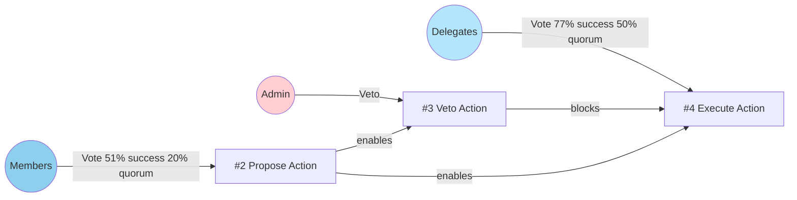
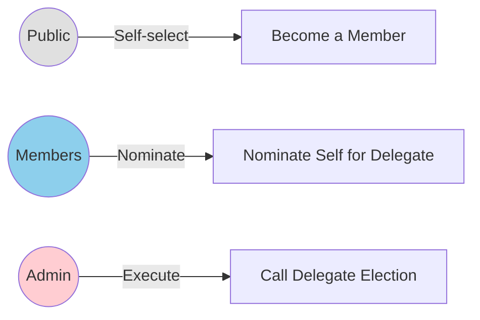

# Powers 101 Organisation Specification

## Organisational Structure & Context

### *Vision & Mission*

Powers 101 is a simple DAO designed to demonstrate the core concepts of the Powers protocol. It provides a basic governance structure with a separation of powers between delegates, members, and an admin, making it an ideal starting point for understanding how the protocol works.

### *Treasury Management*

The organization's treasury is managed through proposals initiated by members and executed by delegates. This model allows for a decentralized approach to treasury management, where the community can propose actions and the elected delegates are responsible for carrying them out.

## Roles

| *Role Id* | *Role name* | *Selection criteria.* |
| :--- | :--- | :--- |
| 0 | Admin | Admin role assigned at deployment. |
| 1 | Members | Anyone can self-select to become a member. |
| 2 | Delegates | Elected by members through a formal election process. |
| … | Public | Everyone. |

## On-chain Laws

### *Executive Laws (executing actions)*

| *Role* | *Name & Description* | *Base contract* | *User Input* | *Executable Output* | *Conditions* |
| :--- | :--- | :--- | :--- | :--- | :--- |
| Members | Propose Action | StatementOfIntent.sol | "address[] Targets", "uint256[] Values", "bytes[] Calldatas" | none | 51% success, 20% quorum, 5 minute voting period |
| Admin | Veto Action | StatementOfIntent.sol | "address[] Targets", "uint256[] Values", "bytes[] Calldatas" | none | Proposal must exist |
| Delegates | Execute Action | OpenAction.sol | (from proposal) | Executes the proposed action | 77% success, 50% quorum, 5 minute voting period, 3 minute delay, proposal must exist, not vetoed |

### *Electoral Laws (assigning roles)*

| *Role* | *Name & Description* | *Base contract* | *User Input* | *Executable Output* | *Conditions* |
| :--- | :--- | :--- | :--- | :--- | :--- |
| Members | Nominate Self for Delegate | NominateMe.sol | none | Adds the caller to the list of nominees for the delegate role. | Caller must be a member. |
| Admin | Call Delegate Election | ElectionStart.sol | none | Starts a new election for the delegate role. | Admin only. |
| Public | Become a Member | SelfSelect.sol | "uint256 roleId" | Assigns the caller the member role. | Public access, 25 block throttle. |

### *Constitutional Laws (adopting and revoking laws)*

There are no specific constitutional laws defined in the Powers 101 organization. Law management is handled by the Admin role.

## Off-chain Operations

### *Dispute Resolution*

Disputes regarding ambiguous law conditions or malicious actions by role-holders will be addressed through community discussion in the official communication channels, with final arbitration by the Admin role if consensus cannot be reached.

### *Code of Conduct / Ethics*

All participants are expected to act in good faith to further the mission of Powers 101. This includes respectful communication, constructive feedback, and responsible use of powers.

### *Communication Channels*

Official proposals, discussions, and announcements take place on the Powers 101 Discord server and community forum.

## Description of Governance

Powers 101 is a decentralized organization designed to showcase the fundamental governance principles of the Powers protocol.

  * **Remit**: The primary function is to provide a simple, transparent, and educational platform for users to learn about decentralized governance.
  * **Roles**: Roles are straightforward: anyone can become a **Member**, members can nominate themselves to be **Delegates**, and an **Admin** role manages the system.
  * **Executive Paths**:
      - **Proposal Lifecycle**: Members propose actions, the Admin can veto them, and Delegates execute approved proposals.
  * **Summary**: The governance structure of Powers 101 is a minimalist implementation of the Powers protocol, demonstrating a clear separation of powers and providing a hands-on learning experience for decentralized governance.

## Governance Flow Diagrams

### Proposal Process

### Electoral Process

