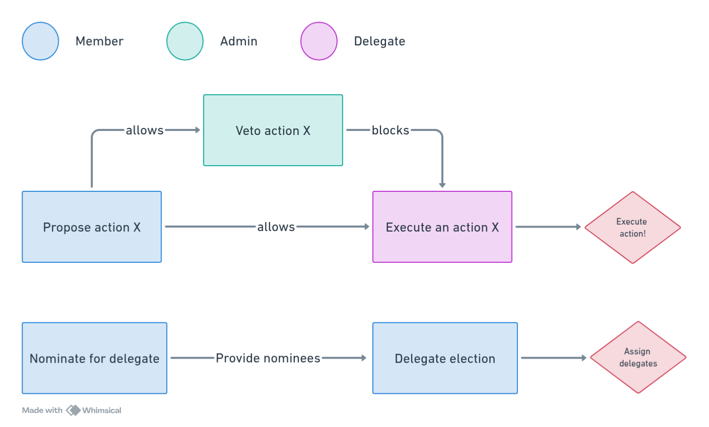

# 💪 Welcome to Powers protocol

🚧 **Documentation is under construction** 🚧

## What it is.

The Powers protocol is a role restricted governance protocol.

This means, simply, that all governance actions are restricted by roles that are assigned to accounts. Only accounts with a 'Senior' role can vote for senior proposals, execute actions designated for seniors, and so on.

It allows for the creation of checks and balances between roles, guard-railing specific (AI agentic) accounts and creating hybrid on- and off-chain organizations, among many other use cases.

The challenge is that actions need to be _restricted_ before they can be _role_ restricted. Role restricted governance protocols only work with external contracts that define which actions a specific role can do under what conditions. These type of protocols become very complex, very quickly.

The Powers protocol provides a minimalist, but very powerful, proof of concept of a role restricted governance protocol.

## Quick links

* [The Github repository](https://github.com/7Cedars/powers)
* [The Powers app](https://powers-protocol.vercel.app/#usecases)

## The protocol

The Powers protocol consists of two elements: Powers and Laws.

### ⚡ Powers

`Powers.sol` is the engine of the protocol that manages governance flows. It should be deployed as is and has the following functionalities:

* Executing actions.
* Proposing actions.
* Voting on proposals.
* Assigning, revoking and labelling roles.
* Adopting and revoking laws.

In addition there is a `constitute` function that allows adopting multiple laws at once. This function can only be called by the admin, and only once.

The governance flow is defined by the following restrictions:

* Executing, proposing and voting can only be done in reference to a role restricted law.
* Roles and laws can only be labelled, assigned and revoked through the execute function of the protocol itself.
* All actions, may they be subject to a vote or not, are executed via Powers' execute function in reference to a law.


[powers.sol](for-developers/powers.sol/)


### 📜 Laws

Laws define under which conditions a role is allowed to execute what actions.

Example:

> Any account that has been assigned a 'senior' role can propose to mint tokens at contract X, but the proposal will only be accepted if 20 percent of all seniors vote in favour.

Laws are contracts that follow the `ilaw.sol` interface. They can be created by inheriting `law.sol` and only have to be deployed once: they can be re-used by Powers.sol instances.&#x20;

Laws have the following functionalities:

* They are role restricted by a single role.
* They are linked to a single `Powers.sol` deployment.
* They have multiple (optional) checks.
* They have a function `executeLaw` that can only be called by their `Powers.sol` deployment.
* They can return three arrays to the Powers contract: targets laws, values and function calls.
* They can save a state.

Many elements of laws can be changed: the input parameters, the function call that is returned, which checks need to pass, what state (if any) is saved. Pretty much anything is possible. Laws are the meat on the bones provided by Powers engine.

What is not flexible, is how Powers interacts with a law. This is done through the `executeLaw` function. When this function is called, the function:

1. Runs the checks
2. Decodes input calldata.
3. Computes return function calls and state change. This can include running additional checks.
4. Saves any state change to the law.
5. Returns the computed function call to Powers for execution.


[law.sol](for-developers/law.sol/)


### 🏛️ Powers + Laws = Governance

Together, Powers and Laws allow communities to build any governance structure that fit their needs. A community starts by deploying a Powers.sol instance, configuring laws, and adopting them in their Powers.sol instance.

The Powers protocol ensures that each community can only interact with their instance of a law. The Yellow community below, for instance, cannot interfere with assigning roles in the Red community. Community governance is protected against outside interference.   &#x20;

<figure><figcaption>
Governance space of the Powers protocol 
</figcaption></figure>

By configuring and adopting laws, it is possible to define the mechanisms through which a role is assigned, the power it has, how roles check and balance each other, and under what conditions this can change. Laws can be used to whitelist actions on a role by role basis or they can be combined in governance chains to create granular checks and balances to the power of roles to execute actions.&#x20;

Example A: Adopt a new law, conditional on a secondary governance check

**Law 1** allows 'members' of a community to propose adopting a new law. Law 1 is subject to a vote, and the proposal will only be accepted if more than half of the community votes in favour.

Alice, as a community member, proposes a law that allows community members to create a grant program with a budget of 500 tokens X. Other community members vote in favor. The proposal passes.

Alice calls the execute function. Now _nothing_ happens. Their proposal has been formalised but no executable call was send to the Powers protocol governing the community.

**Law 2** allows governors in the community to accept and implement new laws. Law 2 is also subject to a vote and, crucially, needs the exact same proposal to have passed at Law 1.

David, who is a senior, notices that a proposal has passed at Law 1. He puts the proposal up for a vote among other seniors. Eve and Helen, the other seniors, vote in favour.

Following the vote, David calls the execute function and the Power protocol implements the action: the new law is adopted and community members will be able to apply to the new grant program.

**Note** that this is a basic example of a governance chain: Multiple laws that are linked together through child-parent relations where a proposal needs to pass a child law before it can executed by a parent law. This chain gave members the right of initiative and governors the right of implementation, creating a balance of power between the two roles.

Example B: Assign governor roles through Liquid Democracy

**Law 1** allows 'members' of a community to nominate themselves for a 'governor' role in their community.

Alice, Bob and Charlotte each call the law through powers `execute` function and save their nomination in the law.

**Law 2** assigns governor roles to accounts saved in Law 1. It does this on the basis of delegated tokens held by accounts. Any account can call the law, triggering (and paying gas costs for) an election.

In January, David obtains a large amount of tokens and delegates them to Bob. He calls law 2 and triggers an election. Alice and Bob are elected and assigned as governors. In the following weeks, he notices that bob is not responding to messages and not voting in elections.

In February, he re-delegates his tokens Charlotte and in the next block calls an election. Alice and Charlotte win the election and are assigned as governors. Bob per immediate effect loses his governor role and all of its privileges.

**Note** that this is an example of assigning roles through what can be called Liquid Democracy. Roles can also be assigned directly, through votes among peers, a council vote or through a minimal threshold of token holdings. Pretty much anything is possible.

For a detailed diagram of how Powers.sol and Law.sol structure governance flows in the Powers protocol, please see the page on [governance flow](for-developers/governance-flow.md).

## Unique strengths

Role restricted governance protocols offer several powerful advantages that make them stand out among existing governance solutions. They excel in simplicity, efficiency, modularity, and flexibility, while introducing innovative features that enhance community governance.

### Assigning roles

The Powers protocol provides a robust and flexible framework for encoding how roles are assigned to accounts: Communities can implement any mechanism they desire for allocating roles but they always have to use established governance mechanisms.&#x20;

It allows token hodlers, builders, validators, institutional members, users or any other stake holder in the community to be contractually represented.

It also allows the use of existing protocols, such as the Hats protocol, to be used for role management.&#x20;

### Voting power

One of the most powerful features is that accounts vote with their roles, not with their tokens. It creates a democratic "1 account = 1 vote" system similar to multisig wallets. This approach ensures clear, straightforward voting mechanics and promotes equal representation within roles.

Communities can enhance this system by implementing sophisticated role assignment mechanisms based on token holdings. As demonstrated in Example B above, this enables flexible governance structures that can incorporate token-based influence while maintaining the benefits of role-based voting.

### Governance chains

A powerful innovation of the protocol is its support for governance chains through consistent proposal ID calculation. By using the same calldata and nonce across different laws, governance actions can be tracked along governance chains.

This feature allows communities to create sophisticated checks and balances between different roles, enabling seamless coordination between different governance layers, through robust decision-making processes that reflect their unique needs.

### Multi Calls

The protocol offers powerful multi-call functionality. While each transaction executes one law at a time, that law can trigger multiple actions through the Powers protocol, enabling efficient and coordinated governance actions.

### Integrations

Powers protocol provides out-of-the-box support for async governance actions. This allows for any type of oracle to be seamlessly integrated into governance actions: randomise allocation of roles, automate governance actions, integrate off-chain voting mechanisms, allow conditional actions based on market conditions, or integrate AI agents in a governance work-flow. Everything is possible.

The protocol also comes with integration modules for popular existing governance protocols such as OpenZeppelin's Governor.sol and Haberdasher's Hats protocol. &#x20;

### Upgradability

The protocol provides excellent flexibility in upgradability. Communities can choose their desired level of mutability by implementing laws for adopting and revoking other laws. This modular approach allows for precise control over governance evolution, with changes possible on a law-by-law basis.

The upgrade process inherently incorporates existing governance checks, allowing communities to implement exactly the level of security and flexibility they need. Whether a community desires rock-solid immutability or dynamic adaptability, the Powers protocol can accommodate their preferences.

## Governance sandbox

Hopefully you have a high-level sense of the particularities of role restricted governance and the Powers protocol. You can check out other pages in this documentation for more detailed information.

Also, you can use the [Powers app](https://powers-protocol.vercel.app) to play around with practical examples to get a better feel for how a role restricted protocol works.
